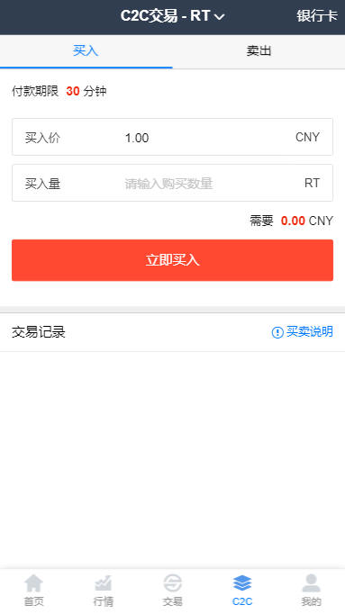

TG： https://t.me/isdapp

# 支持以太坊以及ERC2.0和BTC等 仿火币交易所 otc c2c 币挖矿区块链 机器人 行情同步 pc+app

V2演示地址：https://v2huobi.waps.eu.org/

测试账号：13200010001
一级密码：000000
二级密码：111111

后台登陆： https://v2huobi.waps.eu.org/admin/login?urlkey=123456

账号：admin
密码：admin888

V6版本 升级日志
1：框架安全防御升级，增强安全，稳定。

V5版本  升级日志
1：App增加原生APP 移动端（IOS+Android]）。
2：钱包管理优化升级。
3：稳定性更好。

V3版本  （源码价格 5000u）

1：全新PC版本K线，几十种指标随意切换，划线专业版。

2：全新手机端app和H5版本K线，几十种指标随意切换，划线专业版。

3：C2C的的模式更改为OTC模式。

4：优化交易算法逻辑结构，撮合内核更简洁合理。

5：优化Trade交易界面，布局很合理。

6：优化手机端交易端页面。

V2版本 （源码 4000u）  

1：针对ETH自动转入转出接口的优化，速度很快，算法简洁。

2：针对BTC，USDT以及山寨币接口做了安全升级，多重签名。

3：全站ui用到的js以及css做了优化精简，系统更流畅。

4：行情采集接口去掉循环，改成定时任务模式，系统更流畅方便。

5：机器人做了细化区分，可以设置全虚拟交易，或者可以虚拟和真实的交易对接。

6：定时清理，为了保持系统的流畅稳定，做了定时清理任务，方便运营。

7：ETH端口防护校验提示。

8：增强主流浏览器的兼容性。

功能列表：

以太坊、BTC、USDT所有币完美对接，安全采用多签名技术。

1：无缝对接真实btc，ltc，usdt，以及山寨钱包。

2:   pc+wap，H5超强兼容，一键封装app。

3:   支持多语言

4:   支持币币交易

5:   支持OTC交易

6:   支持Google安全校验

7：支持多种币同时认购

8：支持（存币生息）

9：推荐奖励机制，支持三级奖励（买与卖都可以设置单独奖励）

10：支持充值赠送币

11：支持上币投票

12：支持币分红，全民股东

13：全自动转入转出钱包功能。

14：全自动行情采集，自动刷新。

15：支持全自动模拟交易，曲线自动产生，K线清晰易懂。

## Screenshots

安全的交易所，安全防御如下：

安全防御:

1: 所有钱包端口修改成非常规端口。

2: 硬件防护（所有钱包放入内网机器，无任何外网权限，从而避免黑客调用api接口）。

3: 应用层防护,管理后台只允许内网访问,隔绝外网对钱包操作的高级权限。

4: 钱包key校验规则采用动态密码加静态混合模式，提高钱包自身的安全。

5: 外网采用sll级别的cdn加密加速处理，防止ip泄漏。

6: 应用钱包访问采用多认证（multisignature）在执行一项交易【预算会增加】。

7: 后台地址加key校验以及地址长度高度放大，增加强度。

8: 定期更改各种key和密码。

10: 为了一百的安全，建议定期把大额货币转入线下钱包，做到万无一失。

关于6应用钱包的认证的说明（multisignature）：

1: 本身钱包和服务器通信高强度user和pass密码（1层）。

2: 目前大部分交易所钱包为了方便通讯，没有做encrypt，目前可以通过encrypt手段加固钱包。

   交易所在通讯的时候，通过发送第二层密码，且设置会话超短时间，会话结束后自动

   锁定钱包，从而让钱包达到更安全（2层）

5、请不要以任何这样那样的问题说程序无法运行；

描述此节主要防止骗取源码朋友，报骗取源码心态请绕行；

我们尽快我们所服务能力服务好我们忠实用户；
